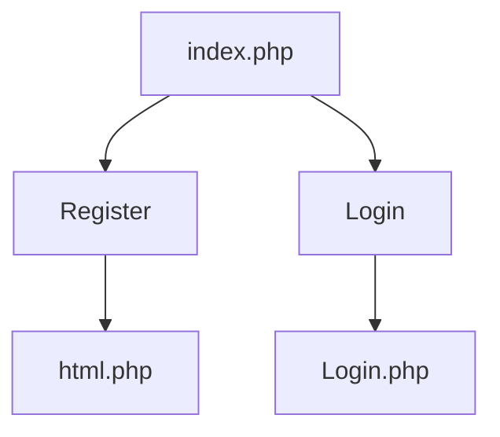
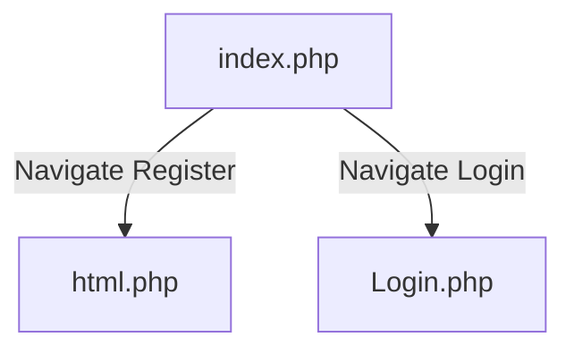
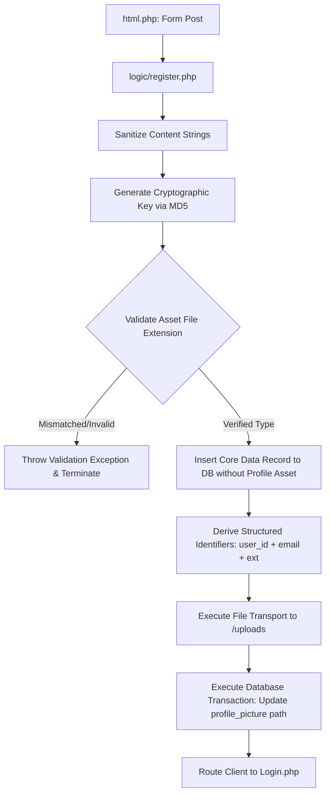
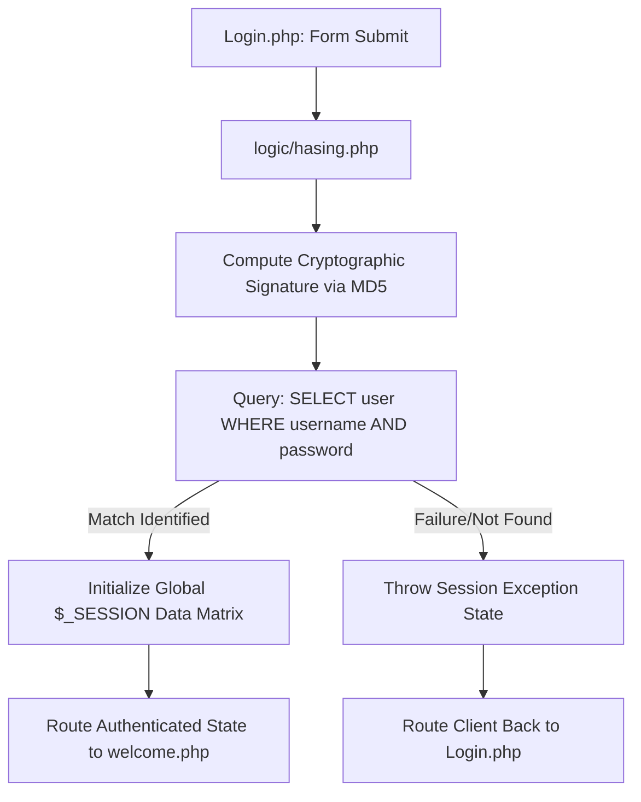
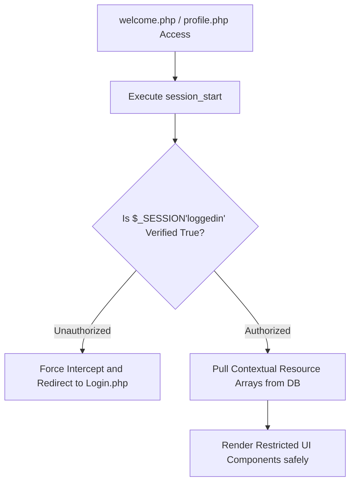
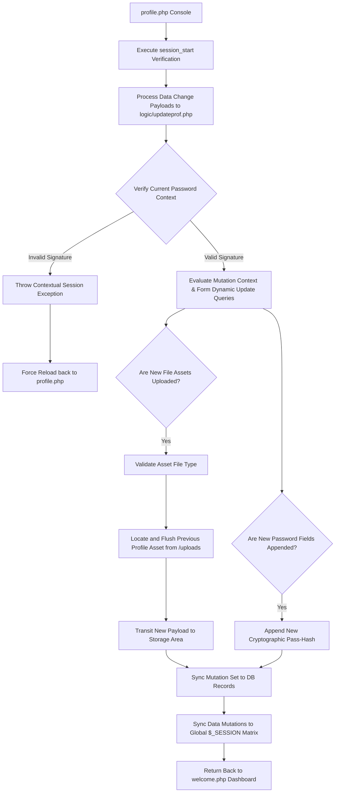
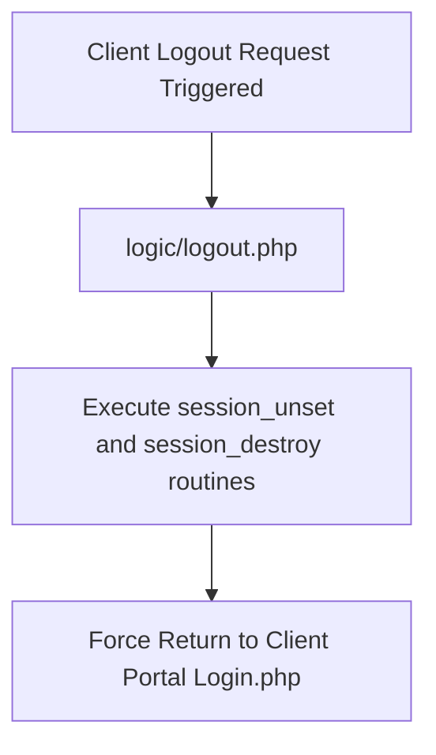

<<<<<<< Updated upstream
```markdown
# Inubrahan PHP User Portal (Register • Login • Profile)

A clean, responsive PHP and MySQL user management system utilizing an architectural separation of UI and business logic. The application features a dynamic frontend powered by Particles.js, secure user state persistent tracking via PHP native sessions, and fully dynamic file handling workflows.

---

## 🚀 Key Features
- **Interactive Landing Hub** — `index.php` routing portal featuring custom frontend transitions.
- **Dynamic Registration Engine** — Complete with instant sanitation, MD5 password hashing, dynamic unique filename generation, and server-side profile picture parsing.
- **Session-Based Authentication** — Secure multi-variable global authentication states across protected endpoints.
- **Gated Architecture** — Enforces active session validation across dashboard resources.
- **Live Profile Dashboard** — Contextual user profile updating workspace supporting multi-part data payload validation.
- **Asynchronous UI Elements** — Seamlessly embedded dynamic loaders and fully customized interactive canvas layers via Particles.js.

---

## 🛠️ Technology Stack
- **Backend:** PHP (Procedural MySQLi, Native Sessions)
- **Database:** MySQL
- **Frontend:** HTML5, CSS3, JavaScript (ES6)
- **Libraries:** Particles.js
=======
# Inubrahan User Portal (Register • Login • Profile)

Small PHP + MySQL project that lets users:
- Register (with profile picture upload)
- Login (session-based)
- View a protected welcome/dashboard page
- Edit profile (update names, optionally change password, optionally upload a new profile picture)
- Logout (destroy session)

Most pages include a **Particles.js** animated background and a loader animation.

---

## Features
- **UI entry**: `index.php` (links to Register / Login)
- **Registration**: `html.php` → `logic/register.php`
- **Login**: `Login.php` → `logic/hasing.php`
- **Protected pages** (login required):
  - `welcome.php`
  - `profile.php`
- **Profile update**: `profile.php` → `logic/updateprof.php`
- **Logout**: `logic/logout.php`

---

## Tech Stack
- PHP (mysqli)
- MySQL
- HTML/CSS/JS
- Particles.js

---

## How it’s organized
### Frontend pages
- `index.php`
- `html.php` (registration form)
- `Login.php` (login form)
- `welcome.php` (dashboard)
- `profile.php` (edit profile)

### Backend logic
- `conn.php` (MySQL connection)
- `logic/register.php` (create user + upload profile picture)
- `logic/hasing.php` (verify credentials + create session)
- `logic/updateprof.php` (verify current password + update profile)
- `logic/logout.php` (session destroy)

### Assets
- `css/style.css`, `css/loader.css`
- `js/particles.js`, `js/particles.json`
- `img/mapache-pedro.gif`
- `uploads/` (profile pictures)

### SQL reference (archive)
- `hawid/bag_o_db.sql`
- `hawid/data1.sql`
>>>>>>> Stashed changes

---

## 📂 Project Directory Structure

<<<<<<< Updated upstream
```text
Car4Rent/
│
├── index.php                 # Core entry point / Landing portal
├── html.php                  # User account creation interface
├── Login.php                 # Authentication login interface
├── welcome.php               # Protected user dashboard (Session gated)
├── profile.php               # Protected profile management console (Session gated)
├── conn.php                  # Centralized MySQL database connection module
│
├── logic/                    # Core Transaction Controllers
│   ├── register.php          # Parsing, sanitation, and file upload runner
│   ├── hasing.php            # Active credential validator and session state initializer
│   ├── updateprof.php        # Dynamic validation and runtime updates runner
│   └── logout.php            # Secure structural session destruction router
│
├── css/                      # Presentation Layout Layers
│   ├── style.css             # Main view presentation configurations
│   └── loader.css            # Pre-render animation states
│
├── js/                       # Dynamic Client Scripts
│   ├── particles.js          # Core canvas engine setup
│   └── particles.json        # Node configuration settings object
│
├── img/                      # Static Presentation Graphics
│   └── mapache-pedro.gif     # System loading asset
│
├── uploads/                  # Managed storage space for dynamic profile avatars
│
└── hawid/                    # Data Layer Configurations
    ├── bag_o_db.sql          # Compiled initial structural schema
    └── data1.sql             # Legacy production snapshot reference

=======
### Landing (`index.php`)


### Registration
```mermaid
flowchart TD
  A[html.php: submit registration] --> B[logic/register.php]
  B --> C[Sanitize inputs]
  C --> D[Hash password (MD5)]
  D --> E[Validate uploaded picture extension]
  E -->|Invalid| F[Stop with error]
  E -->|Valid| G[Insert user into DB]
  G --> H[Rename uploaded file: user_id + email + extension]
  H --> I[Move file to /uploads]
  I --> J[Update user.profile_picture]
  J --> K[Redirect to login.php]
```

### Login / Session creation
```mermaid
flowchart TD
  A[Login.php: submit login] --> B[logic/hasing.php]
  B --> C[Hash password (MD5)]
  C --> D[SELECT user WHERE username=? AND password=?]
  D -->|Found| E[Set session variables]
  E --> F[Redirect to welcome.php]
  D -->|Not found| G[Set login_error]
  G --> H[Redirect to login.php]
```

### Protected welcome (`welcome.php`)
```mermaid
flowchart TD
  A[welcome.php] --> B[session_start]
  B --> C{$_SESSION['loggedin'] == true ?}
  C -->|No| D[Redirect to login.php]
  C -->|Yes| E[Fetch user details from DB]
  E --> F[Render dashboard]
```

### Protected profile edit (`profile.php`)
```mermaid
flowchart TD
  A[profile.php] --> B[session_start]
  B --> C{loggedin == true ?}
  C -->|No| D[Redirect to login.php]
  C -->|Yes| E[Render profile form]

  E --> F[Submit form]
  F --> G[logic/updateprof.php]
  G --> H[Verify current_password (MD5 compare)]
  H -->|Wrong| I[Redirect to profile.php]
  H -->|Correct| J[Build UPDATE query]
  J --> K[Update username/firstname/lastname]
  J --> L[If new_password provided, update password]
  J --> M[If new picture uploaded, validate + replace file]
  M --> N[Update profile_picture in DB]
  N --> O[Update session vars]
  O --> P[Redirect to welcome.php]
```

### Logout
```mermaid
flowchart TD
  A[Logout] --> B[logic/logout.php]
  B --> C[session_unset + session_destroy]
  C --> D[Redirect to login.php]
>>>>>>> Stashed changes
```

---

<<<<<<< Updated upstream
## 📊 Application Architecture & Flowcharts

### 1. Unified Portal Entry Vector



### 2. Registration and Asset Ingestion Pipeline



### 3. Verification Sequence & Session Compilation



### 4. Gated Route Protection Validation



### 5. Multi-Part Profile Mutation Sequence



### 6. Session Lifecycle Destruction



---

## 🗄️ Database Provisioning

The storage configuration runs on a localized schema container termed **`data1`** managing target relation table arrays matching **`user`**.

1. Access your relational database engine admin console (e.g., phpMyAdmin).
2. Clean existing conflict relations if performing a clean tracking cycle:
```sql
DROP TABLE IF EXISTS user;

```


3. Process structural file recovery via parsing the script file:
`hawid/bag_o_db.sql`

### 🔑 Shared Target Testing Profiles

* **Profile Identification Name:** `herta`
* **Security String Value:** `qwe`

---

## ⚡ Setup & Execution Context

1. Clone or drop the source repository package directly inside your engine root location directory (e.g., XAMPP `htdocs/Car4Rent`).
2. Boot your stack services console elements ensuring **Apache** and **MySQL** modules are listening correctly.
3. Establish database setup routing workflows as detailed in the provisioning specifications block above.
4. Launch your local browser application target and connect using local application pipelines:
`http://localhost/Car4Rent/index.php`
=======
## Database / Setup
### DB name
- **Database**: `data1`
- **Table**: `user`

### Import (typical)
1. Create/select database `data1` in phpMyAdmin.
2. Import the schema from `hawid/bag_o_db.sql`.

*(Your `hawid/` folder is kept as reference/archive files.)*

### Test account (from your notes)
- username: `herta`
- password: `qwe`

---

## Quick Start (Local)
1. Copy this project into your web server root (e.g., `XAMPP/htdocs/`).
2. Start **Apache** and **MySQL**.
3. Import the `user` table into database `data1`.
4. Open:
   - `http://localhost/<your-folder-name>/index.php`

---

## Notes (important)
- Passwords are hashed using **MD5** in this project (educational/demo only; not recommended for production).
- Uploaded profile pictures are restricted to: `jpg, jpeg, png, gif`.
>>>>>>> Stashed changes

---

## ⚠️ Security Infrastructure Disclaimer

* **Cryptographic Schemes:** This codebase uses MD5 message-digest evaluations for authentication workflows. It serves purely as an architecture demonstration structure and is explicitly **not safe** or intended for raw production deployment models. Upgrades to modern one-way key derivation schemes like `password_hash()` are recommended for public deployment.
* **File Asset Rules:** Asset indexing parses strings as `user_id_email.extension` strings into local structural directories, safeguarding execution patterns by restricting file movement actions to `/uploads/`.

```

```
