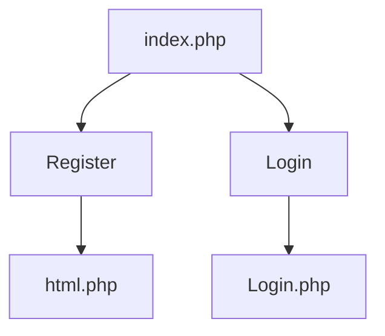
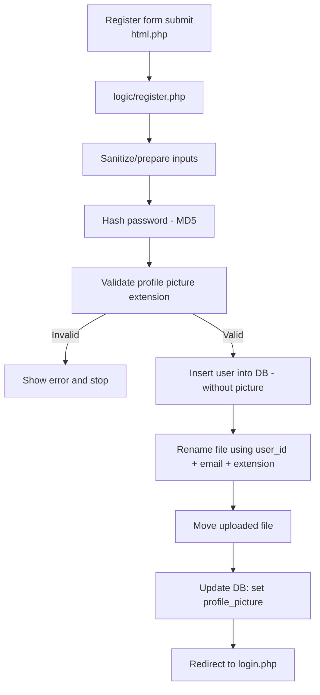
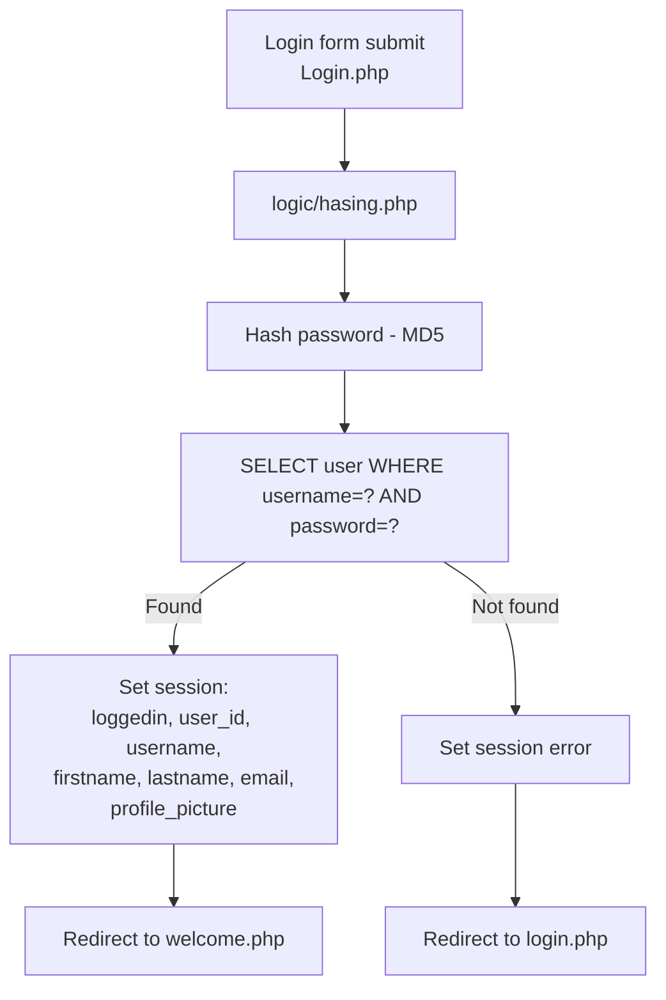
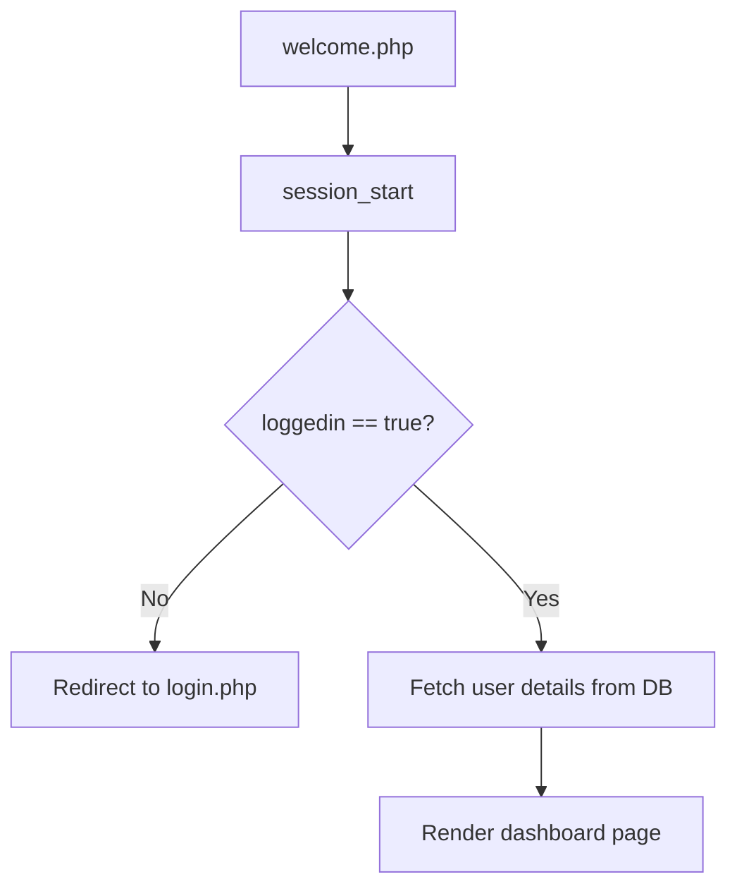
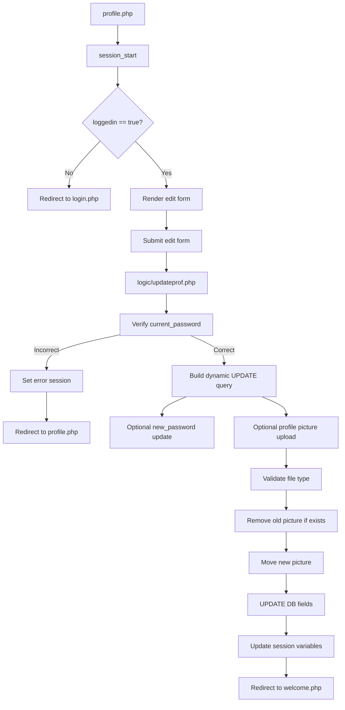
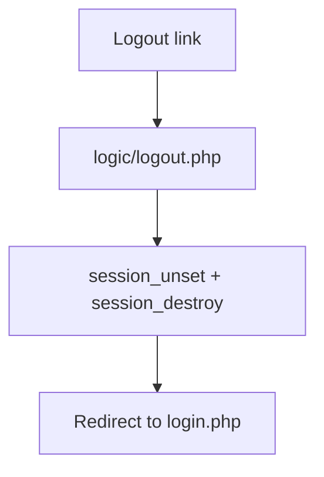

# 🦝 Inubrahan — PHP User Portal

> A small but complete PHP + MySQL user portal with registration, login, profile editing, and session-based authentication — wrapped in a Particles.js UI.


---

## Overview

Inubrahan is a lightweight PHP user portal that covers the full authentication cycle:

- **Landing page** — choose to Register or Login
- **Registration** — sign up with a profile picture upload
- **Login** — session-based authentication
- **Dashboard** — protected welcome page shown after login
- **Profile editing** — update name, password, and profile picture
- **Logout** — destroys the session cleanly

All pages feature a **Particles.js** animated background and a **loader** animation.

---

## Tech Stack

| Layer | Technology |
|---|---|
| Backend | PHP (mysqli) |
| Database | MySQL |
| Frontend | HTML, CSS, JavaScript |
| Background FX | Particles.js |

---

## Project Structure

```
Inubrahan-User-Portal/
│
├── index.php               # Landing page
├── html.php                # Registration form
├── Login.php               # Login form
├── welcome.php             # Dashboard (protected)
├── profile.php             # Edit profile (protected)
├── conn.php                # Database connection
│
├── logic/
│   ├── register.php        # Handles registration + picture upload
│   ├── hasing.php          # Login verification + session creation
│   ├── updateprof.php      # Validates password + updates profile
│   └── logout.php          # Session destroy
│
├── css/
│   ├── style.css
│   └── loader.css
│
├── js/
│   ├── particles.js
│   └── particles.json
│
├── img/
│   └── mapache-pedro.gif
│
├── uploads/                # Stores user profile pictures
│
└── hawid/
    ├── bag_o_db.sql        # Main SQL file to import
    └── data1.sql
```

---

## Database Setup

This project uses a MySQL database named **`data1`** with a table called **`user`**.

1. Start **MySQL** via XAMPP (or your preferred stack).
2. Open **phpMyAdmin** and create a database named `data1`.
3. Import the SQL file:
   ```
   hawid/bag_o_db.sql
   ```
4. If you hit a conflict with an existing `user` table, run:
   ```sql
   DROP TABLE user;
   ```
   Then re-import.

---

## Quick Start

1. Clone or copy the project folder into your web server root (e.g., XAMPP's `htdocs/`):
   ```bash
   git clone https://github.com/Nazonokage/Inubrahan-User-Portal.git
   ```
2. Start **Apache** and **MySQL** in XAMPP.
3. Follow the [Database Setup](#database-setup) steps above.
4. Open your browser and navigate to:
   ```
   http://localhost/<your-folder-name>/index.php
   ```

---

## ⚠️ Security Notice

> **This project is intended for learning purposes only — do not deploy it as-is in production.**

- Passwords are hashed with **MD5**, which is cryptographically broken. A real app should use `password_hash()` with `PASSWORD_BCRYPT`.
- No CSRF protection is implemented on forms.
- Input sanitization is basic — a production app would need more robust validation.

---

## Flowcharts

### 1 — Landing Page



---

### 2 — Registration Flow

New users fill in the form on `html.php`, which submits to `logic/register.php` for processing.



---

### 3 — Login Flow

Credentials from `Login.php` are checked in `logic/hasing.php`, which creates the session on success.



---

### 4 — Protected Dashboard

`welcome.php` checks for an active session before rendering anything.



---

### 5 — Protected Profile Editing

`profile.php` validates the session, then routes edits through `logic/updateprof.php`.



---

### 6 — Logout



---

*Built with PHP, MySQL, and a raccoon gif. 🦝*
