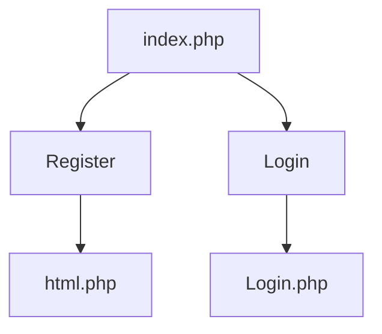
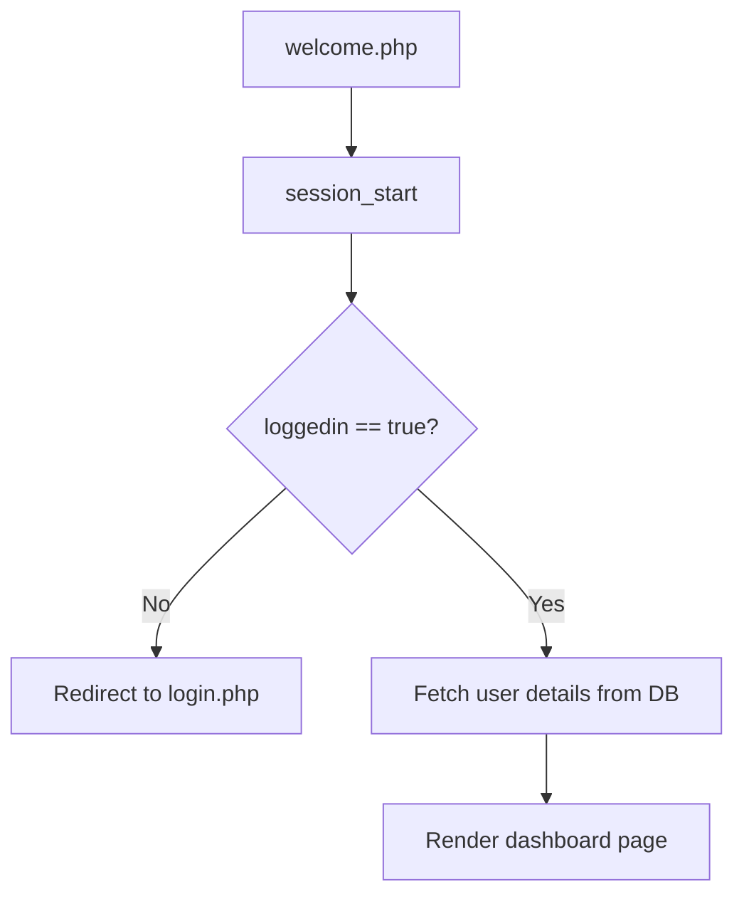
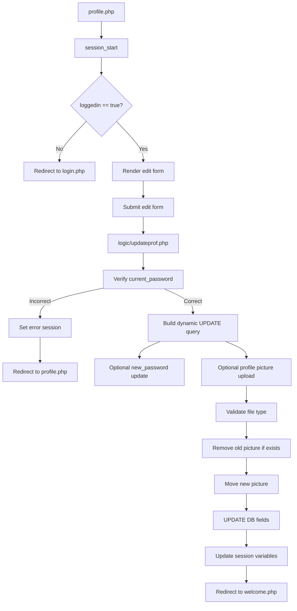
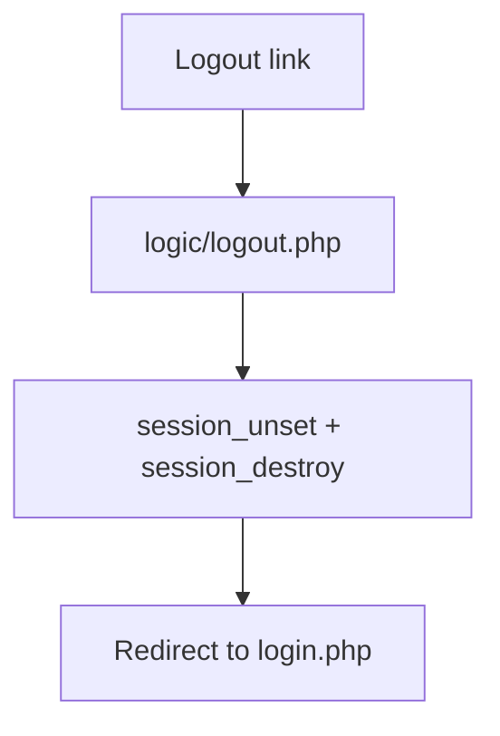

# Inubrahan PHP User Portal (Register • Login • Profile)


## What this project is
This is a small PHP + MySQL project that provides:
- **Landing page** (choose Register or Login)
- **User registration** (includes **profile picture upload**)
- **Login** (session-based authentication)
- **Protected dashboard** (welcome page)
- **Protected profile editing** (update name/surname, optionally change password, optionally upload new profile picture)
- **Logout** (destroys the session)

Most pages use a **Particles.js** background and a **loader** animation.

---

## Technologies
- PHP (mysqli)
- MySQL (database `data1`)
- HTML/CSS/JS
- Particles.js (background)

---

## Project Structure
### Main PHP pages (UI)
- `index.php` — landing page
- `html.php` — registration form
- `Login.php` — login form
- `welcome.php` — dashboard/welcome page (**requires login**)
- `profile.php` — edit profile page (**requires login**)

### Configuration
- `conn.php` — database connection to MySQL

### Backend logic (form handlers)
- `logic/register.php` — inserts new user + uploads profile picture
- `logic/hasing.php` — login verification + sets session
- `logic/updateprof.php` — validates current password + updates profile/picture
- `logic/logout.php` — session destroy

### Assets
- `css/style.css`, `css/loader.css`
- `js/particles.js`, `js/particles.json`
- `img/mapache-pedro.gif`
- `uploads/` — stores user profile pictures

### SQL notes
- `hawid/bag_o_db.sql`
- `hawid/data1.sql`

---

## Flowcharts

### 1) Landing (index)


### 2) Registration flow
```mermaid
flowchart TD
  A[Register form submit
(html.php)] --> B[logic/register.php]
  B --> C[Sanitize/prepare inputs]
  C --> D[Hash password (MD5)]
  D --> E[Validate profile picture extension]
  E -->|Invalid| F[Show error and stop]
  E -->|Valid| G[Insert user into DB (without picture)]
  G --> H[Rename file using user_id + email + extension]
  H --> I[Move uploaded file]
  I --> J[Update DB: set profile_picture]
  J --> K[Redirect to login.php]
```

### 3) Login flow (session creation)
```mermaid
flowchart TD
  A[Login form submit
(Login.php)] --> B[logic/hasing.php]
  B --> C[Hash password (MD5)]
  C --> D[SELECT user WHERE username=? AND password=?]
  D -->|Found| E[Set session:
loggedin, user_id, username,
firstname, lastname, email,
profile_picture]
  E --> F[Redirect to welcome.php]
  D -->|Not found| G[Set session error]
  G --> H[Redirect to login.php]
```

### 4) Protected welcome/dashboard


### 5) Protected profile editing


### 6) Logout


---

## Database Setup
Your project uses MySQL database **`data1`** and a table **`user`**.

Based on your existing `info.md` notes:
1. Import DB using phpMyAdmin
2. Apply (if needed):
   - `DROP TABLE user;`
3. Import SQL file:
   - `hawid/bag_o_db.sql`
4. (Your note mentions applying via phpMyAdmin admin routes, e.g. importing into db `data1`.)

### Existing account (from your notes)
- username: `herta`
- password: `qwe`

---

## Quick Start (Local)
1. Copy project folder into your web server root (e.g., XAMPP `htdocs/`).
2. Start **Apache** and **MySQL**.
3. Import the database/table `user` into **`data1`**.
4. Open:
   - `http://localhost/<your-folder-name>/index.php`

---

## Notes
- Password hashing in this project uses **MD5** (not recommended for real production apps).
- Profile pictures are stored in `uploads/` and renamed to `user_id_email.extension`.
- `welcome.php` and `profile.php` protect pages with `$_SESSION['loggedin']`.


